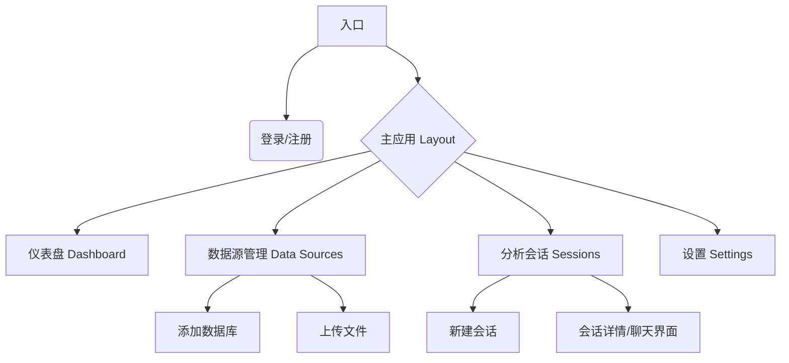

# Fast Data Agent 前端设计文档 (UI/UX)

## 1. 设计概述

**Fast Data Agent** 是一个专业的 AI 数据分析平台。前端设计应体现"智能、专业、高效"的特点，侧重于数据可视化的清晰度和对话交互的流畅性。

### 1.1 设计原则
*   **Data-First (数据优先)**: 界面应最大化数据展示空间，减少不必要的装饰。
*   **Conversational (对话式)**: 核心交互通过自然语言对话完成，界面需提供清晰的上下文和反馈。
*   **Transparent (透明可控)**: 清晰展示 AI 的思考过程（SQL 生成、Python 执行）、中间结果和最终产物。
*   **Modern & Clean (现代简洁)**: 采用深色模式/浅色模式切换，使用扁平化、高对比度的设计风格。

### 1.2 技术栈建议
*   **框架**: Next.js 14+ (App Router)
*   **语言**: TypeScript
*   **样式**: Tailwind CSS
*   **组件库**: shadcn/ui (基于 Radix UI) + Lucide React (图标)
*   **AI 交互**: Vercel AI SDK (`@ai-sdk/react`)
*   **图表**: Plotly.js (与后端一致)
*   **状态管理**: Zustand / React Query

---

## 2. 信息架构 (Site Map)

---

## 3. 核心页面设计

### 3.1 登录/注册 (Auth)
*   **布局**: 左右分栏。左侧为产品 Slogan 和 动态数据可视化演示背景；右侧为简洁的表单。
*   **表单**: 邮箱/密码登录，支持 "记住我"。

### 3.2 仪表盘 (Dashboard)
*   **概览卡片**:
    *   总数据源数量 (活跃/异常)
    *   本周分析会话数
    *   生成的图表数量
*   **快速开始**: "新建分析会话"、"连接新数据源" 的大按钮。
*   **最近活动**: 列出最近访问的会话列表，带时间戳和最后一条摘要。

### 3.3 数据源管理 (Data Sources)
*   **列表页**: 卡片式或表格布局。
    *   展示图标 (MySQL/PG/CSV/Excel)。
    *   状态指示灯 (绿色=连接正常, 红色=连接失败)。
    *   操作: 编辑、刷新 Schema、删除。
*   **添加数据源 (Modal/抽屉)**:
    *   **Tab 1: 数据库**: 选择类型 (PG/MySQL/SQLite) -> 输入连接串 -> 测试连接 -> 保存。
    *   **Tab 2: 文件**: 拖拽上传区域 (支持 CSV/Excel/Parquet) -> 预览前5行 -> 确认上传。

### 3.4 分析会话 (Chat Interface) - **核心页面**
这是用户停留时间最长的页面，采用经典的三栏布局：

*   **左侧边栏 (Sidebar)** (可折叠):
    *   "新建会话" 按钮。
    *   历史会话列表 (按时间分组: 今天, 昨天, 更早)。
    *   当前会话关联的数据源列表。

*   **主聊天区 (Main Chat)**:
    *   **消息流**:
        *   **User**: 右侧气泡。
        *   **Assistant**: 左侧。包含 Markdown 文本渲染。
        *   **Tool Call (折叠/展开)**:
            *   `SQL 执行`: 显示生成的 SQL 语句 (代码高亮)，点击展开查看原始 SQL。
            *   `Python 执行`: 显示 Python 代码片段。
        *   **Artifacts (产物)**:
            *   **表格**: 嵌入式表格组件，支持基础排序/分页。
            *   **图表**: 交互式 Plotly 图表。
            *   **错误**: 红色警告框，提供重试按钮。
    *   **输入区**:
        *   多行文本输入框 (Textarea Autosize)。
        *   发送按钮 (Enter 发送, Shift+Enter 换行)。
        *   停止生成按钮 (仅在生成时显示)。
        *   附件按钮 (仅支持上传到当前会话的临时文件)。

*   **右侧面板 (Context Panel)** (可选/可折叠):
    *   **任务推荐**: 根据当前数据源推荐的分析方向 (Overview, Trend, Anomaly)。点击直接发送。
    *   **文件列表**: 当前会话生成的所有文件 (图表 HTML, 结果 CSV/Parquet) 下载链接。

---

## 4. 交互细节 (UX Flows)

### 4.1 新建分析流程
1.  用户点击 "新建会话"。
2.  弹窗选择要分析的数据源 (多选，例如选择 "销售数据库" 和 "Q3预算表.xlsx")。
3.  进入聊天界面，系统自动发送 "已加载 [数据源名称]，您可以问我关于..." 的欢迎语。
4.  右侧面板展示针对选中数据的 "推荐分析任务" (如 "分析上个月销售趋势")。

### 4.2 数据分析循环 (The Loop)
1.  **提问**: 用户输入 "帮我分析上季度销售额下滑的原因"。
2.  **思考**: AI 显示 "正在思考..." -> "正在查询数据库..."。
3.  **执行**:
    *   前端接收到 SSE 事件 `tool-input-available`，显示 "执行 SQL 查询..." 的加载条。
    *   前端接收到 `tool-output-available`，如果包含 SQL 结果，渲染为折叠的 JSON/Table 预览。
4.  **可视化**:
    *   AI 决定画图，调用 `generate_chart`。
    *   前端解析 `artifact` 中的 Plotly JSON，直接在对话流中渲染图表。
5.  **追问**: 用户基于图表继续提问 "把这个图按地区拆分看看"。

### 4.3 错误处理
*   **SQL 错误**: 如果后端返回 SQL 执行失败，前端应以红色引用块显示错误信息，并允许用户点击 "让 AI 修复" (自动发送修复指令)。
*   **网络中断**: 自动重连机制，或允许用户手动刷新。

---

## 5. 主题与样式 (Theming)

### 字体 (Typography)
*   **英文字体**: Inter (清晰、现代、适合阅读代码)。
*   **中文字体**: Noto Sans SC / 系统默认无衬线字体。
*   **代码字体**: JetBrains Mono / Fira Code。

---

## 6. 开发路线图

1.  **Phase 1: 基础框架**: 集成 Shadcn/ui，实现登录和布局。
2.  **Phase 2: 数据源管理**: 实现文件上传 (MinIO) 和 数据库连接配置表单。
3.  **Phase 3: 聊天核心**: 集成 Vercel AI SDK，实现流式对话，Markdown 渲染。
4.  **Phase 4: 高级交互**: 实现 Tool Call 可视化 (SQL/Code 高亮)，Plotly 图表渲染。
5.  **Phase 5: 优化**: 移动端适配，暗黑模式，性能优化。

